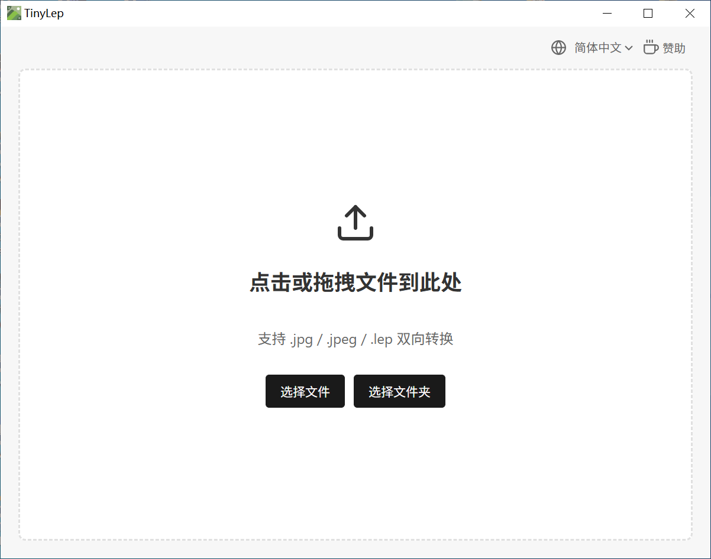
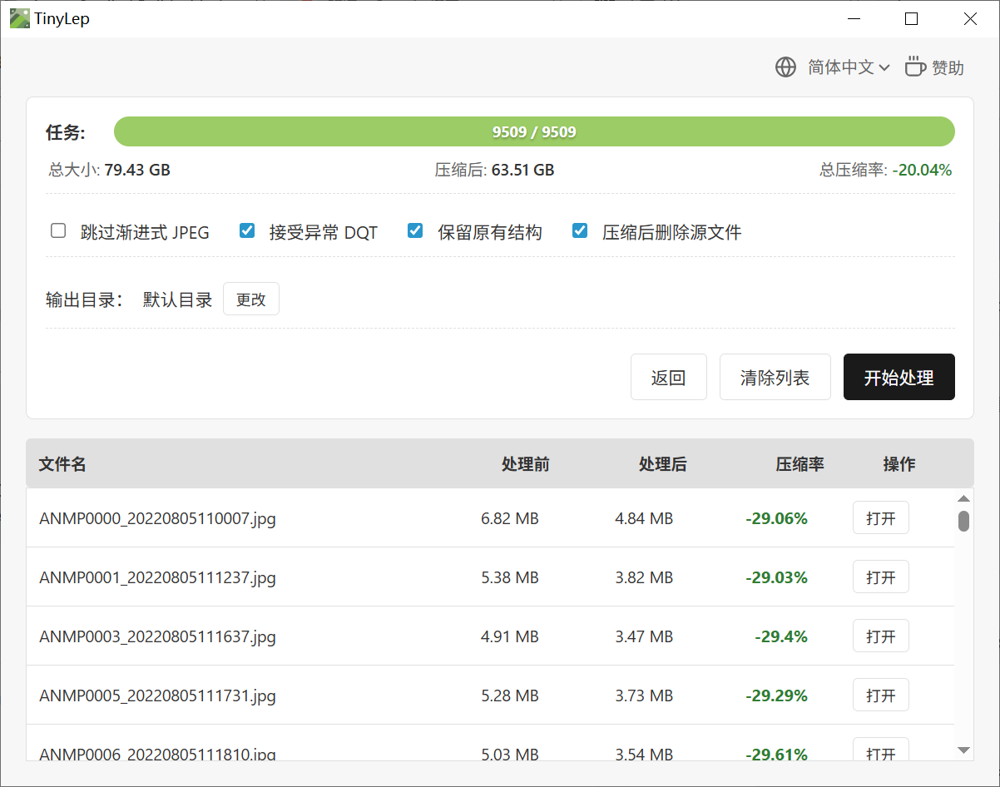

# TinyLep

[简体中文](./README.md) | [English](./README.EN.md)

Lepton is a lossless JPG compression tool developed by Dropbox that can reduce file sizes by approximately 20% without losing image quality. This project is based on Microsoft's open-source [lepton_jpeg_rust](https://github.com/microsoft/lepton_jpeg_rust) (the Rust port of Dropbox Lepton) to implement image compression and decompression.


This project is built with Rust and Tauri.

## Page Preview





### Performance Benchmark

Tested with 480 JPG photos totaling 1.36 GB. The time comparison between the Compatible version (x64) and the AVX instruction set version is as follows:

| Operation     | x64     | AVX    |
| ------------- | ------- | ------ |
| Compression   | 41.38   | 39.28  |
| Decompression | 1:01.64 | 58.49  |

> Note: Timing was recorded manually and may contain some error. The time consumption is mainly due to hard disk I/O reading.

## Build from Source

[Rust 1.89 or higher](https://www.rust-lang.org/tools/install)

Install dependencies:

```bash
npm install
```

Run in development mode:

```bash
npm run dev
```

Build package (Compatible version):

```bash
npm run build
```

Build package (AVX instruction set):

```bash
npm run build:avx
```

## Lepton Utility Trio

To make Lepton both compact after compression and previewable like an uncompressed JPG, you can download the following trio:

1. **TinyLep**: this project, a batch lossless JPG compression tool that compresses files and folders by drag-and-drop.
2. **[LepViewer](https://github.com/2010HCY/LepViewer)**: double-click to instantly preview `.lep` files like ordinary images, without manual decompression.
3. **[LepThumb](https://github.com/2010HCY/LepViewer/LepThumb)**: a Windows Explorer thumbnail plugin that allows direct preview of `.lep` thumbnails in folders.
4. **[LeptonWASM](https://github.com/2010HCY/LeptonWASM)**: Enables websites or web applications to natively support the previewing and processing of the Lepton format.

## Acknowledgements

This project uses Dropbox Lepton. Special thanks to the **Microsoft team** for open-sourcing the Rust port and refactoring of the Lepton tool: [lepton_jpeg_rust](https://github.com/microsoft/lepton_jpeg_rust)

## Appreciate

If these tools are helpful to you, feel free to support:


